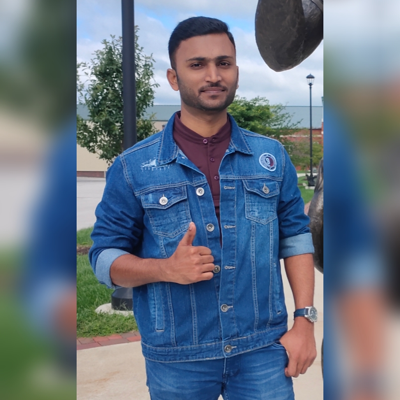

# Rakesh Somanaboina

I like reading and understanding people. I am not too fond of people getting emotional for small things. I admire emotionally strong people. I rely completely on my ability to work hard to excel at anything. I like helping strangers get through their problems if I’m stable myself. I don’t do it as often as I used to. I am mostly good with my choice of words while interacting with people. People tend to trust me easily. I find it hard to decide when to give up on something.

 I have captured this picture at NWMSU.

***
### My sport preferences

In the below table, I'm going to recommend few sports like Cricket, Kabaddi, Badminton and Chess with the reason and the time required to spend per week which must be given a try.
| Name | Reason | Time recommended |
| --- | --- | ---: |
| Cricket | It develops the skills like leadership, team coordination | Atleast 3-4 hrs per week |
| Kabaddi | It helps in developing physical strength and tactics | Atleast 1-2 hrs per week |
| Badminton | It helps in improving the flexibility and mobility | Atleast 1-3 hrs per week  |
| Chess | It helps in improving thinking capacity | Atleast 1 hr per week |
